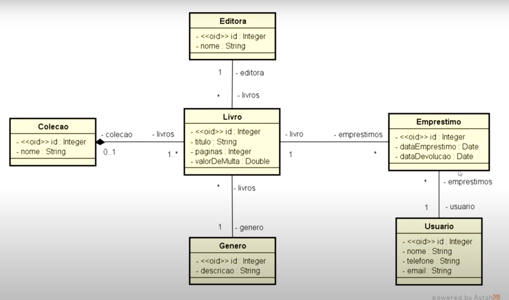

# Biblioteca
 

# Sobre o projeto

Bibliotecas é uma API REST desenvolvida com SpringFramework. Essa aplicação esta baseada nos requisitos e diagrama UML abaixo, um exercicio do curso de Modelagem de Dados com UML (DevSuperior).

## Requisitos
Uma biblioteca deseja fazer o registro de seus empréstimos de livros. Quando um usuário pega um livro emprestado, deve ser registrada a data de emprestimo. 
Por padrão, o prazo de empréstimo é de 2 dias, considerando atraso se o livro for devolvido depois deste tempo.
Cada livro possui título, genero, editora e numero de páginas. Um livro pode participar de uma coleção. Cada livro possui também um valor diário de multa, caso
o usuário devolva o livro com atraso em relação à data prevista de devolução.

## UML - Modelo conceitual

# Tecnologias utilizadas
## Back end
- Java 17
- Spring Boot 2.7.1
- JPA / Hibernate
- Maven
- Banco de dados H2.
- Spring Tool Suite 4

# Autor

William Henrique Campos

https://www.linkedin.com/in/william-henrique-campos-98568813a/

